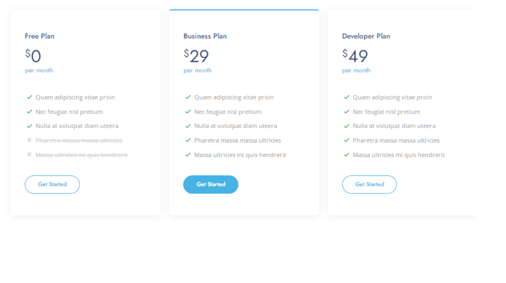

# 💳 Responsive Pricing Cards

A simple and elegant component featuring **3 responsive pricing cards**, built using **HTML**, **CSS**, and **Bootstrap 5**.  
This layout is ideal for SaaS, service websites, or product pages.

Feel free to get inspired or reuse it in your own projects.

## 📸 Preview

  

## 🧱 Technologies Used
- HTML5
- CSS3
- Bootstrap 5

## 📱 Features
- 💡 Clean and modern design
- 📐 Fully responsive (mobile-friendly)
- 🌙 Customizable pricing, features, and styling
